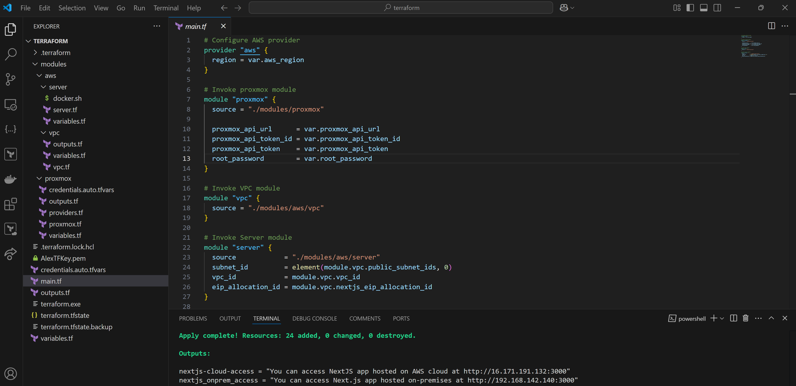
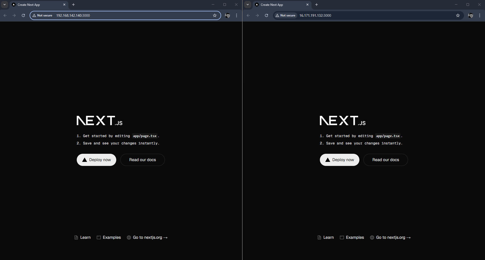

# Automate containerized NextJS app deployment on hybrid architecture with Terraform

### Table of Contents
- [Introduction](#introduction)
  - [Overview of Terraform](#overview-of-terraform)
  - [Benefits of Hybrid Architecture with Terraform](#benefits-of-hybrid-architecture-with-terraform)
- [Prerequisites](#prerequisites)
- [Terraform Configurations](#terraform-configurations)
  - [On-Premises (Proxmox)](#on-premises-proxmox)
  - [Cloud (AWS)](#cloud-aws)
    - [VPC Module](#vpc-module)
    - [EC2 Module](#ec2-module)
  - [Parent Module](#parent-module)
- [Results](#results)
- [Conclusions](#conclusions)
  - [Key Considerations](#key-considerations)


# Introduction

In today's fast-paced cloud infrastructure landscape, **automation** plays a crucial role in ensuring efficient and reliable deployments. By leveraging the power of **Terraform** for infrastructure automation, organizations can establish a streamlined, repeatable deployment process that minimizes manual effort and operational complexity.

This guide walks you through automating the deployment of a containerized Next.js application in a **hybrid architecture** using Terraform. We will cover the step-by-step process of provisioning the necessary infrastructure. This approach enhances consistency, scalability, and deployment speed, all while adhering to infrastructure-as-code (IaC) best practices.

## Overview of Terraform

**Terraform** is an open-source Infrastructure as Code (IaC) tool developed by HashiCorp. It enables users to define, provision, and manage infrastructure using a declarative configuration language. Terraform is widely used to automate the setup and management of cloud resources across various providers such as AWS, Azure, Google Cloud, and others

## Benefits of hybrid architecture with Terraform

Automating the deployment of NextJS application in a hybrid architecture using Terraform brings several advantages, including:

- **Infrastructure as Code (IaC)**
    - By leveraging Terraform, you define your hybrid infrastructure (e.g., ECS, VPCs, IAM roles on AWS cloud) as code, which enables *version control* (i.e. tracking and managing changes to your infrastructure through Git or other version control systems) and *reproducibility* (i.e. replicating the same infrastructure in different environments, such as development, testing, production).
- **Consistency**
    - Terraform ensures that infrastructure is deployed consistently, eliminating configuration drift and reducing the risk of human error during manual deployments.
- **Scalability**
    - With Terraform, you can easily scale your web application deployment to accommodate growing workloads by adjusting configuration parameters (e.g., EC2 instance type and EBS volume, ASG, VPC on AWS, storage from Proxmox side, etc.).
- **Performance**
    - Automating the deployment process drastically reduces the time needed to provision and configure resources, enabling faster project setups and iterations.
- **Cost Optimization**
    - Terraform allows for automated cleanup of unused resources, ensuring cost-effective management of AWS services. You can also deploy only the necessary components during non-peak hours to further optimize costs.
- **Cross-Cloud Compatibility**
    - Terraform's provider-agnostic architecture allows you to extend your deployment to other cloud providers or hybrid environments, enabling future flexibility without rework.
- **Seamless Updates & Rollbacks**
    - Infrastructure changes can be applied and rolled back with minimal effort, ensuring safe updates to your deployment and quick recovery in case of issues.
- **Integration with CI/CD pipelines**
    - Terraform scripts and state can be migrated into HCP Terraform (Cloud), which enables the integration between IaC and CI/CD pipelines, hence enabling fully automated deployments whenever new changes are committed to the codebase.
- **Disaster Recovery**
    - Terraform enables easy recreation of your entire hybrid infrastructure from scratch in case of failures, ensuring business continuity.

# Prerequisites

Before proceeding with the deployment of NextJS application on a a hybrid architecture via Terraform, ensure the following requirements are met:

1. **Terraform** 
    - Install Terraform on your local machine. You can download Terraform from the [official website.](https://developer.hashicorp.com/terraform/install)
    - Verify the installation by running `terraform -v` command.
2. **NextJS app (containerized version)**
    - You will have to create a Docker Image for NextJS app and push it to a docker registry where you will be able to pull from.
3. **AWS account**
    - An active AWS account is required with the necessary permissions to create and manage resources such as EC2, and VPC
4. **AWS CLI (optional)**
    - In case you want to define AWS credentials using `aws configure` command, rather than exporting those as environmental variables
5. **Proxmox**
    - Install Proxmox on your on-premises infrastructure, as well as use a container template with Docker installed

# Terraform configurations

This section details the Terraform setup required to automate the deployment of NextJS app on hybrid architecture. It covers:

- **On-premises (Proxmox) module:** Creates Proxmox LXC container with pre-defined compute, storage, and networking configurations
- **Cloud (AWS) modules:**
    - **VPC Module**: Defines the networking infrastructure, including subnets, route tables, and internet gateways.
    - **EC2 Module**: Manages the provisioning of EC2 instances where CData Sync will be deployed.
- **Parent Module**: Orchestrates and integrates on-prem and cloud modules to ensure seamless deployment.

Each module is structured to ensure scalability, security, and automation, making NextJS app deployment efficient and reproducible across the different infrastructures.

Below is a breakdown of the directory and file structure:

```bash
TERRAFORM/
├── modules/                                  # Directory containing reusable Terraform modules
│   ├── aws/                                    # AWS-specific modules
│   │   ├── server/                               # Server (EC2) module
│   │   │   ├── docker.sh                           # Shell script to install Docker
│   │   │   ├── server.tf                           # Main Terraform configuration for the EC2 instance
│   │   │   ├── variables.tf                        # Input variables for the server module
│   │   ├── vpc/                                  # VPC module
│   │   │   ├── outputs.tf                          # Outputs for the VPC module
│   │   │   ├── variables.tf                        # Input variables for the VPC module
│   │   │   ├── vpc.tf                              # Main Terraform configuration for networking resources (VPC, subnets, etc.)
│   ├── proxmox/                                # Proxmox-specific modules
│   │   ├── credentials.auto.tfvars               # Credentials file for Proxmox authentication
│   │   ├── outputs.tf                            # Outputs for the Proxmox module
│   │   ├── providers.tf                          # Provider configuration for Proxmox
│   │   ├── proxmox.tf                            # Main Terraform configuration for Proxmox infrastructure
│   │   ├── variables.tf                          # Input variables for the Proxmox module
├── credentials.auto.tfvars                   # Global credentials file (auto-loaded by Terraform)
├── main.tf                                   # Main Terraform configuration file that invokes the modules
├── outputs.tf                                # Global outputs for the entire project
├── terraform.exe                             # Terraform executable
├── variables.tf                              # Global input variables for the entire project
```

## On-premises (Proxmox)

Within the `proxmox` subdirectory of the project, the following Terraform configuration files are configured:

```bash
terraform {
  required_providers {
    proxmox = {
      source  = "Telmate/proxmox"
      version = "3.0.1-rc4"
    }
  }
}
```

`provider.tf` file specifies the required Terraform provider for Proxmox, configuring its source and version.

```bash
provider "proxmox" {
  # Configuration options
  pm_api_url          = var.proxmox_api_url
  pm_api_token_id     = var.proxmox_api_token_id
  pm_api_token_secret = var.proxmox_api_token
  pm_tls_insecure     = true
}

# Create LXC container
resource "proxmox_lxc" "basic" {
  target_node = "pve"
  hostname    = "terraformer"
  ostemplate   = "local:vztmpl/debian-12-standard-custom_12.7-1_amd64.tar.gz"
  password     = var.root_password
  unprivileged = true

  rootfs {
    storage = "local-lvm"
    size    = "16G"
  }

  memory = 2048
  cores  = 2
  swap   = 2048
  onboot = true
  start  = true

  network {
    name   = "eth0"
    bridge = "vmbr0"
    ip     = "192.168.142.140/24"
    gw     = "192.168.142.2"
  }

  features {
    nesting = true
  }

  provisioner "remote-exec" {
    inline = [
      "docker container run -d -p 3000:3000 --name nextjs-app aleksanderp01/nextjs-app:latest"
    ]

    connection {
      type     = "ssh"
      user     = "root"
      password = var.root_password
      host     = "192.168.142.140"
    }
  }
}
```

`proxmox.tf` file creates a Proxmox LXC container with specific settings, including storage, networking, and Docker configuration for deploying the containerized NextJS application stored in Docker Hub.

```bash
# Proxmox module variables

variable "proxmox_api_url" {
  description = "The URL of the Proxmox API"
  type        = string
}

variable "proxmox_api_token_id" {
  description = "The Proxmox API token ID"
  type        = string
}

variable "proxmox_api_token" {
  description = "The Proxmox API token"
  type        = string
}

variable "root_password" {
  description = "The root password for the container"
  type        = string
}
```

`variables.tf` file defines input variables for Proxmox global settings (Proxmox API URL, API Token, etc.), as well as LXC container’s root password.

```bash
# Proxmox module outputs

output "proxmox_lxc_container_ip" {
  value = split("/", proxmox_lxc.basic.network[0].ip)[0]
}
```

`outputs.tf` file defines output values for the Proxmox module, specifically the IP address of the LXC container, which will be referenced to the root output for accessing NextJS app deployed on-prem.

## Cloud (AWS)

This subsection leverages AWS to host the containerized NextJS application, ensuring scalability, high availability, and seamless integration with cloud-native services. It is organized as following:

### VPC module

Within the `vpc` directory of the project, the following Terraform configuration files are configured:

```bash
# Fetch the list of availability zones in the current AWS region
data "aws_availability_zones" "available" {}

# Define the VPC
resource "aws_vpc" "main" {
  cidr_block           = var.vpc_cidr
  enable_dns_support   = true
  enable_dns_hostnames = true

  tags = {
    Name        = var.vpc_name
    Environment = "dev"
    Terraform   = "true"
  }
}

# Create Public Subnets
resource "aws_subnet" "public_subnets" {
  count                 = min(var.public_subnet_count, length(data.aws_availability_zones.available.names))
  vpc_id                = aws_vpc.main.id
  cidr_block            = cidrsubnet(var.vpc_cidr, 8, count.index + 100)
  availability_zone     = data.aws_availability_zones.available.names[count.index]
  map_public_ip_on_launch = true

  tags = {
    Name        = "alex_tf_public_subnet_${count.index + 1}"
    Environment = "dev"
    Terraform   = "true"
  }
}

# Create Private Subnets
resource "aws_subnet" "private_subnets" {
  count            = min(var.private_subnet_count, length(data.aws_availability_zones.available.names))
  vpc_id           = aws_vpc.main.id
  cidr_block       = cidrsubnet(var.vpc_cidr, 8, count.index)
  availability_zone = data.aws_availability_zones.available.names[count.index]

  tags = {
    Name        = "alex_tf_private_subnet_${count.index + 1}"
    Environment = "dev"
    Terraform   = "true"
  }
}

# Create Internet Gateway
resource "aws_internet_gateway" "igw" {
  vpc_id = aws_vpc.main.id

  tags = {
    Name        = "alex_tf_internet_gateway"
    Environment = "dev"
    Terraform   = "true"
  }
}

# Create EIP
resource "aws_eip" "nextjs_eip" {
  depends_on = [aws_internet_gateway.igw]
  tags = {
    Name = "alex_tf_igw_eip"
  }
}

# Create Route Table for Public Subnets
resource "aws_route_table" "public" {
  vpc_id = aws_vpc.main.id

  route {
    cidr_block = "0.0.0.0/0"
    gateway_id = aws_internet_gateway.igw.id
  }

  tags = {
    Name        = "alex_tf_public_route_table"
    Environment = "dev"
    Terraform   = "true"
  }
}

# Associate Public Subnets with the Public Route Table
resource "aws_route_table_association" "public" {
  count          = length(aws_subnet.public_subnets)
  route_table_id = aws_route_table.public.id
  subnet_id      = aws_subnet.public_subnets[count.index].id
}

# Create Route Table for Private Subnets
resource "aws_route_table" "private" {
  vpc_id = aws_vpc.main.id

  tags = {
    Name        = "alex_tf_private_route_table"
    Environment = "dev"
    Terraform   = "true"
  }
}

# Associate Private Subnets with the Private Route Table
resource "aws_route_table_association" "private" {
  count          = length(aws_subnet.private_subnets)
  route_table_id = aws_route_table.private.id
  subnet_id      = aws_subnet.private_subnets[count.index].id
}
```

`vpc.tf` configuration file sets up a structured VPC with both public and private subnets across different AZs, ensuring internet access for public resources, while keeping private resources isolated.

```bash
# VPC module variables

variable "vpc_cidr" {
  description = "The CIDR block for the VPC"
  default     = "10.0.0.0/16"
}

variable "vpc_name" {
  description = "The name of the VPC"
  default     = "alex-tf-vpc"
}

variable "public_subnet_count" {
  description = "Number of public subnets to create"
  default     = 3
}

variable "private_subnet_count" {
  description = "Number of private subnets to create"
  default     = 3
}
```

Within `variables.tf` file we define the variables of the module, which provide flexibility in defining the VPC architecture, ensuring scalability while maintaining modularity in Terraform deployments. Variables like `vpc_cidr`, `public_subnet_count`, have been defined in this file, while being interpolated to the previous configuration file.

```bash
# VPC module outputs

output "vpc_id" {
  description = "The ID of the VPC"
  value       = aws_vpc.main.id
}

output "public_subnet_ids" {
  description = "IDs of the public subnets"
  value       = aws_subnet.public_subnets[*].id
}

output "private_subnet_ids" {
  description = "IDs of the private subnets"
  value       = aws_subnet.private_subnets[*].id
}

output "internet_gateway_id" {
  description = "ID of the Internet Gateway"
  value       = aws_internet_gateway.igw.id
}

output "nextjs_eip_allocation_id" {
  value = aws_eip.nextjs_eip.id
}

output "nextjs_eip_address" {
  value = aws_eip.nextjs_eip.public_ip
}

output "aws_availability_zones" {
  description = "The availability zones"
  value = data.aws_availability_zones.available.names
  
}
```

`outputs.tf` file defines Terraform outputs for the VPC module, allowing other modules to reference key resources created within the VPC. The outputs provide essential details about the infrastructure components. This configuration is crucial, as it will enable the invocation of VPC module resources into the parent module, from where the Terraform will get executed and create the state.

### EC2 module

Within the `server`directory of the project, the following Terraform configuration files are configured:

```bash
#Lookup Latest Ubuntu 22.04 AMI Image
data "aws_ami" "ubuntu" {
  most_recent = true

  filter {
    name   = "name"
    values = ["ubuntu/images/hvm-ssd/ubuntu-jammy-22.04-amd64-server-*"]
  }

  filter {
    name   = "virtualization-type"
    values = ["hvm"]
  }

  owners = ["099720109477"]
}

#Build EC2 instance in Public Subnet
resource "aws_instance" "nextjs_ubuntu" {
  ami                         = data.aws_ami.ubuntu.id
  instance_type               = var.instance_type
  subnet_id                   = var.subnet_id
  security_groups             = [aws_security_group.nextjs_sg.id]
  associate_public_ip_address = true
  key_name                    = aws_key_pair.generated.key_name

  connection {
    user        = "ubuntu"
    private_key = tls_private_key.generated.private_key_pem
    host        = self.public_ip
  }

 # Upload the docker.sh file
  provisioner "file" {
    source      = "${path.module}/docker.sh"
    destination = "/tmp/docker.sh"
  }

  # Run the docker.sh file using remote-exec
  provisioner "remote-exec" {
    inline = [
      "chmod +x /tmp/docker.sh",
      "sudo /tmp/docker.sh",
      "sudo docker container run -d -p 3000:3000 --name nextjs-app aleksanderp01/nextjs-app:latest"
    ]
  }

  tags = {
    Name = "Terraform EC2 Server"
  }

  lifecycle {
    ignore_changes = [security_groups]
  }
}

#Associate Elastic IP with EC2 Instance
resource "aws_eip_association" "ec2_eip" {
  instance_id   = aws_instance.nextjs_ubuntu.id
  allocation_id = var.eip_allocation_id
}

#Create Security Group to allow SSH, and NextJS traffic
resource "aws_security_group" "nextjs_sg" {
  name        = "alex-nextjs-terraform-sg"
  description = "Security group for web servers allowing SSH, and NextJS app access, created with Terraform"
  vpc_id      = var.vpc_id

  ingress {
    description = "Allow SSH access"
    from_port   = 22
    to_port     = 22
    protocol    = "tcp"
    cidr_blocks = ["0.0.0.0/0"]
  }

  ingress {
    description = "Allow access to NextJs app"
    from_port   = 3000
    to_port     = 3000
    protocol    = "tcp"
    cidr_blocks = ["0.0.0.0/0"]
  }

  egress {
    description = "Allow all outbound traffic"
    from_port   = 0
    to_port     = 0
    protocol    = "-1"
    cidr_blocks = ["0.0.0.0/0"]
  }
}

#Generate SSH Key Pair for EC2 Instance
resource "aws_key_pair" "generated" {
  key_name   = "AlexTFKey"
  public_key = tls_private_key.generated.public_key_openssh
}

resource "tls_private_key" "generated" {
  algorithm = "RSA"
}

resource "local_file" "private_key_pem" {
  content  = tls_private_key.generated.private_key_pem
  filename = "AlexTFKey.pem"
}
```

`server.tf` configuration file automates the deployment of an Ubuntu-based EC2 instance with a dockerized NextJS application. It ensures the instance is publicly accessible via SSH, and allows access to NextJS app. The setup also enforces security best practices with a dedicated security group and an SSH key pair created locally and uploaded to AWS.

```bash
# EC2 module variables

variable "instance_type" {
  description = "The type of the EC2 instance"
  type    = string
  default = "t3.micro"
}

variable "subnet_id" {
  description = "Public subnet id where the EC2 instance will be deployed"
  type        = string
}

variable "vpc_id" {
  description = "VPC id where the EC2 instance will be deployed"
  type        = string
}

variable "eip_allocation_id" {
  description = "Elastic IP allocation id to associate with the EC2 instance"
  type = string
}
```

`variables.tf`configuration file defines input variables for configuring an EC2 instance. These variables allow for flexible and reusable deployments by parameterizing key properties of the EC2 instance (allowing users to customize instance type, networking, and IP settings without modifying the core infrastructure code).

## Parent module

Within the `root`directory of the project, the following Terraform configuration files are configured:

```bash
# Configure AWS provider
provider "aws" {
  region = var.aws_region
}

# Invoke Proxmox module
module "proxmox" {
  source = "./modules/proxmox"

  proxmox_api_url      = var.proxmox_api_url
  proxmox_api_token_id = var.proxmox_api_token_id
  proxmox_api_token    = var.proxmox_api_token
  root_password        = var.root_password
}

# Invoke VPC module (AWS)
module "vpc" {
  source = "./modules/aws/vpc"
}

# Invoke Server module (AWS)
module "server" {
  source            = "./modules/aws/server"
  subnet_id         = element(module.vpc.public_subnet_ids, 0)
  vpc_id            = module.vpc.vpc_id
  eip_allocation_id = module.vpc.nextjs_eip_allocation_id
}
```

`main.tf` configuration file modularizes infrastructure by separating *on-prem* (Proxmox module) from *cloud* (AWS) configurations. AWS module in addition is modularized into *networking* (VPC module) and *compute resources* (EC2 module).

It enables reusability and scalability, as each module can be modified independently. It also improves flexible deployment, as users can change AWS regions or subnet allocation without modifying core infrastructure code.

```bash
# Global variables

variable "proxmox_api_url" {
  description = "The URL of the Proxmox API"
  type        = string
}

variable "proxmox_api_token_id" {
  description = "The Proxmox API token ID"
  type        = string
}

variable "proxmox_api_token" {
  description = "The Proxmox API token"
  type        = string
}

variable "root_password" {
  description = "The root password for the container"
  type        = string
}

variable "nextjs_port" {
  description = "Port where the Next.js app will be running"
  type        = number
  default     = 3000
}

variable "aws_region" {
  description = "The AWS region to deploy the resources"
  type        = string
  default     = "eu-north-1"
}
```

`variables.tf` configuration file defines global variables to ensure flexibility and maintainability in the infrastructure deployment (allowing Proxmox credentials,  AWS Region or NextJS port modifications without affecting core infrastructure logic).

```bash
# Global outputs

output "nextjs_onprem_access" {
  value = "You can access Next.js app hosted on-premises at http://${module.proxmox.proxmox_lxc_container_ip}:${var.nextjs_port}"
}

output "nextjs-cloud-access" {
  value= "You can access NextJS app hosted on AWS cloud at http://${module.vpc.nextjs_eip_address}:${var.nextjs_port}"
}
```

`outputs.tf` configuration file in this module defines 2 global outputs that provide easily accessible URLs for NextJS app deployment on both on-prem and cloud infrastructures, once the Terraform operation succeeds.

# Results

This section demonstrates the results after applying Terraform configuration files. Once `terraform apply` command is executed, all the child modules invoked on the parent module of `main.tf` file trigger API communications with the selected providers in terms of resources to be created.

In the end of the process, the console prints out accessible URLs for visiting containerized NextJS application deployed seamlessly both on-prem and cloud environment. 




# Conclusions

The automation of a containerized Next.js application deployment across a hybrid architecture using Terraform streamlines infrastructure management while ensuring scalability and consistency. By leveraging Infrastructure as Code (IaC), teams can efficiently provision and maintain resources across both on-premises environments (via Proxmox) and cloud platforms (AWS).

This approach enhances deployment flexibility by integrating on-prem and cloud resources seamlessly, enabling workload portability and optimizing cost governance. By adopting a structured automation workflow, organizations can achieve a more resilient and scalable infrastructure, reducing manual intervention and minimizing configuration drift. Future optimizations can focus on refining orchestration processes, enhancing CI/CD pipelines, and incorporating service mesh solutions for improved interconnectivity across the hybrid environment.

## Key Considerations

For teams replicating this workflow, security and cost governance must anchor the design. Credentials should never be hardcoded in Terraform configuration files (instead define those as environment variables either locally or migrate to HCP Terraform Cloud). Although the state file will always keep sensitive information as visible, make sure to utilize a remote backend storage (where the state and the rest of providers are stored) that encrypts the data at rest (i.e. ‘s3’ remote backend). In order to enforce *PoLP* (Principle of Least Privilege), make sure to create custom IAM Roles and attach the sufficient privileges to the IAM User for accomplishing the tasks of this article. In addition, reliability hinges on pre-deployment staging tests and Terraform state locking (S3 + DynamoDB) to avoid conflicts (in case 2 or more users update Terraform state at the same time, you should consider state locking feature).
Finally, in terms of State Management, for multi-cloud deployments centralize Terraform state in a cloud-agnostic storage system (e.g., HashiCorp Consul) to avoid fragmentation.